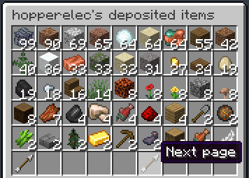

ItemRace is a Minecraft plugin for Paper servers that allows players to compete to get the most items. It is highly configurable, allowing it to be used for short events, long-term competitions, or just keeping track of what items players are getting!

## Default behaviour
*Keep in mind that this is only the default behavior and can be configured using the `config.yml` file created in the `ItemRace` directory when the plugin is enabled for the first time.
For example, you could make it so players are simply scored on the number of diamonds currently in their inventory and ender chest, or for every type of item they have had at least 3 of in their inventory at some point.*

Players must deposit items using `/itemrace deposit`, which will open up the deposit GUI for them to place items inside.

Players can deposit absolutely any item except for air. Once they close the deposit GUI, those items will move to their ItemRace inventory, which they cannot take items back out of.

Players can also deposit items directly into their ItemRace inventory using:
- `/itemrace deposit all`: deposit all items in their inventory with the same type as the item in their hand
- `/itemrace deposit inventory`: deposit all items in their inventory, regardless of type
- `/itemrace deposit (amount)`: deposit `amount` of the type of item in their hand from their inventory
- `/itemrace deposit (amount) (item)`: deposit `amount` of `item` from their inventory

Players can also create a list of items which get automatically deposited as soon as they enter their own inventory
- `/itemrace autodeposit`: opens a GUI to toggle which items to auto-deposit
  
  
- `/itemrace autodeposit add (item)`: starts auto-depositing `item`
- `/itemrace autodeposit remove (item)`: stops auto-depositing `item`

Players are scored based on the items currently in their ItemRace inventory. Players will gain one point each time the amount of a type of item they have doubles. That is, they will get a point for their 1st, 2nd, 4th, 8th, 16th, 32nd, 64th, 128th... item of each type, with no limit. For example, if a player deposits 128 dirt and 4 cobblestone, they will earn 11 points (8 points for dirt and 3 points for cobblestone).

The current leaderboard can be viewed using `/itemrace leaderboard`

or using the sidebar which can be toggled using `/itemrace togglescoreboard`.

Players can view each other's ItemRace inventories using `/itemrace inventory`, which will open up a paginated GUI listing deposited items.

From the deposited items GUI, players can also access a list of other players for whom to view the deposited items.

## Point award modes
These are how the plugin chooses which items to award points for.

	
AUTO_DEPOSIT_ALL

	
All items a player picks up are automatically moved into their ItemRace inventory, which they cannot take items out of.

	
AUTO_DEPOSIT

	

    Similar to AUTO_DEPOSIT_ALL but only items which the player can earn points for will be deposited.
    This is only really useful if a denylist has been created
    

	
DEPOSIT_COMMAND

	

    Similar to AUTO_DEPOSIT, but players choose which items to move to their ItemRace inventory using `/itemrace deposit`.
    If no arguments are specified, the item in the player's hand is deposited.
    

	
DEPOSIT_GUI (default)

	

    Similar to DEPOSIT_COMMAND except, if no arguments are specified, then an inventory GUI is opened.
    Players can move any items they wish to deposit into that inventory.
    

	
MAX_INVENTORY

	
Similar to AUTO_DEPOSIT, but players do not lose deposited items. Instead, their ItemRace inventory is based on the maximum amount of a given item they have held in their inventory at any time.

	
INVENTORY

	
Players are scored based on the items currently in their inventory.

	
ENDER_CHEST

	
Similar to INVENTORY, but also includes items in their ender chest.

## ItemRace inventory persisting
For award modes which use the ItemRace inventory (which does not include INVENTORY or ENDER_CHEST), the plugin is able to persist (and auto-save at a configurable interval) the contents of each player's ItemRace inventory (and autodeposit list) between server restarts. This data is saved to the file `plugins/ItemRace/data.yml`.

## Permissions
- **itemrace.admin:** Permission to use all ItemRace admin commands
- **itemrace.reset:** Allows resetting players' scores using `/itemrace reset [player]`
- **itemrace.deposit *(default)*:** Allows depositing items in MANUAL_DEPOSIT mode using `/itemrace deposit`
- **itemrace.inventory:** Allows viewing players' ItemRace inventories using `/itemrace inventory [player]`
- **itemrace.inventory.self *(default)*:** Allows viewing your own ItemRace inventory using `/itemrace inventory`
- **itemrace.leaderboard *(default)*:** Allows viewing the ItemRace leaderboard using `/itemrace leaderboard`
- **itemrace.togglescoreboard:** Allows toggling the scoreboard using `/itemrace togglescoreboard`
- **itemrace.autodeposit *(default)*:** Allows creating a list of items to auto-deposit on a per-player basis using `/itemrace autodeposit`